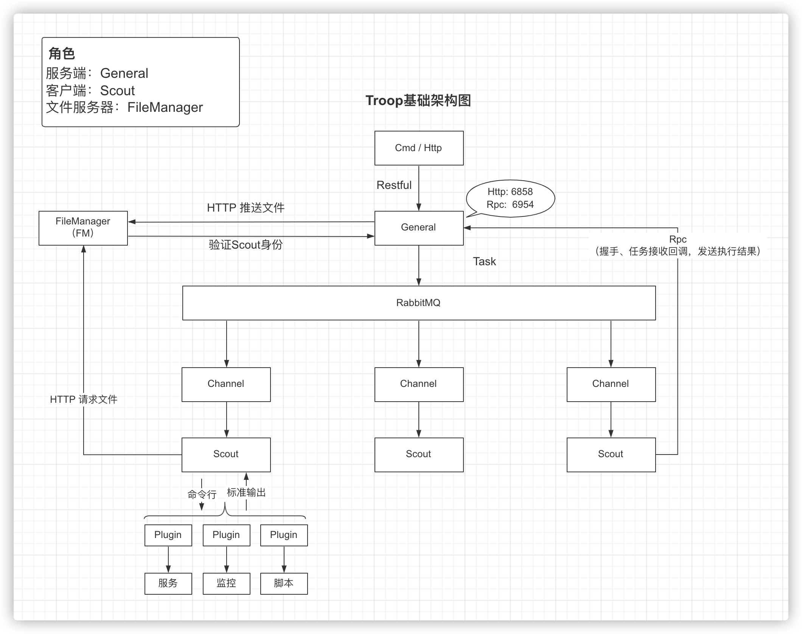
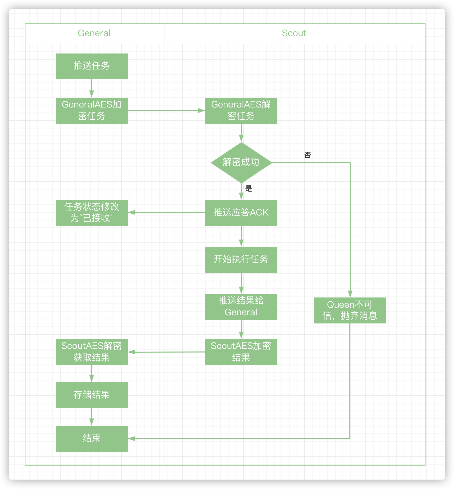
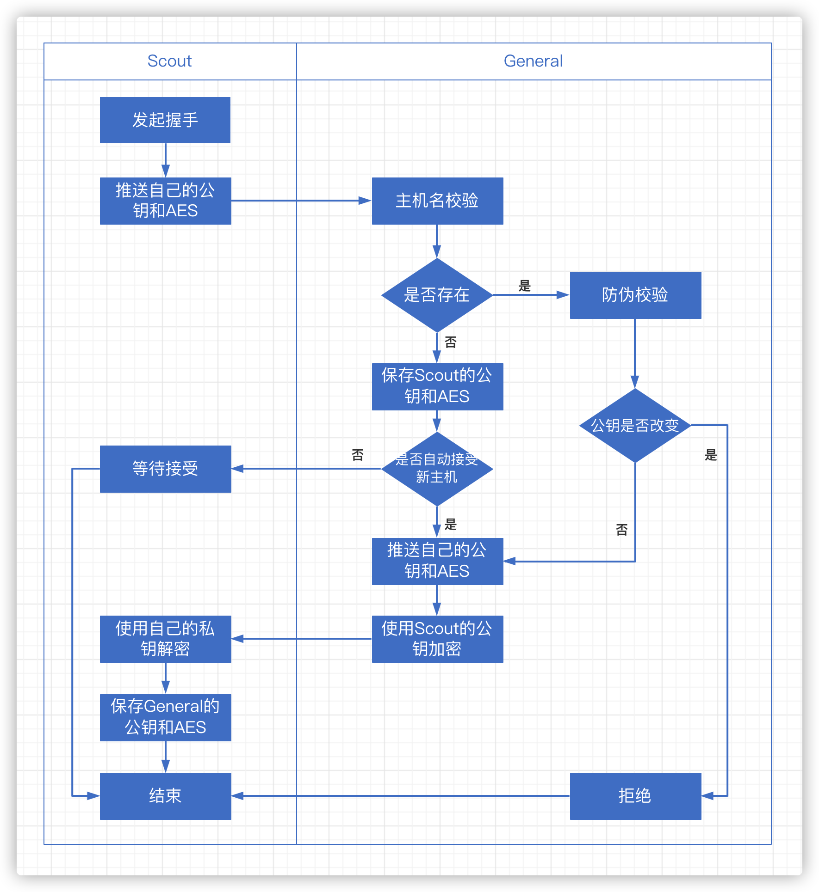

<br>
Troop是基于Go语言开发的运维自动化管理工具，能够对服务器实现批量操作，并且完美支持Linux和Windows系统。


## 文档 
- [快速安装](https://github.com/kurolz/troop-service)
- [API文档](https://troop.docs.apiary.io/)

## 源码启动
```shell
git clone https://github.com/troopstack/troop
cd troop
./control build
```

## 模块
- 服务端：General
- 客户端：Scout
- 文件服务器：FileManager
- 命令行工具：Client

## 类或术语说明
- General: Troop系统中的服务端，是所有Scout的控制器。
- Scout: Troop系统中的客户端，是运行在每台服务器上的Agent。
- 握手: 密钥交换过程，服务端和客户端互相交换并保存对方的「RSA公钥」和「AES密钥」。

## 特点
- 高可用：Scout和General通过单向RPC通信，Server无状态可横向扩缩
- 安全性：传输过程中的所有数据都通过RSA或旋转AES加密
- 速度快：充分利用Go语言的特性提高性能
- 可扩展：任何语言编写的脚本或二进制文件，可作为插件下发给Scout
- 自升级：Scout和插件互相管理，通过Scout管理插件的版本，反过来通过插件也能管理Scout的版本

## 用户交互
- API调用
- 命令行工具

## 系统架构图


## 任务下发
##### 默认支持三种基础任务：
- 检测连通性
- 执行Command
- 推送文件

##### 有四种指定任务执行主机的方式：
1. 指定一个或多个主机名执行
3. 指定操作系统执行
4. 指定带Tag的主机执行
5. 指定带Tag的主机中任意一台执行

##### 任务下发过程如下图：


## 数据安全性
Troop服务端和客户端之间的交互通过公私钥和旋转密钥来加密数据。
- 客户端第一次启动时会生成一对自己的「RSA密钥」。
- 客户端和服务端每次重启都会重新生成自己的「AES密钥」。
- 客户端每次重启都会向服务端发起一次握手，把主机信息包括公钥和AES推送给服务端，服务端接收校验后保存主机信息，并返回自己的AES给客户端保存。
- 服务端每次重启都会通知所有客户端重新握手。

##### 密钥使用：
- 客户端RSA密钥（A）：为了保证B密钥不泄露，服务端向客户端传输B密钥时通过A密钥加密。
- 服务端AES密钥（B）：服务端向客户端推送的消息使用B密钥加密。
- 客户端AES密钥（C）：客户端向服务端推送任务结果使用C密钥加密。


##### 客户端和服务端握手交换密钥的过程如下图：


## 插件
使用插件来扩展功能，来完成一些个性化任务。

插件是任意编程语言编写的脚本打包成的二进制文件，并且提供执行参数。所有插件通过Git管理，自动下发到Scout。

Troop自带了**ScoutManager**插件。如果成千上万台机器上安装了Scout，Scout的更新维护就成了大问题。服务端可以向ScoutManager下发停止、重启、升级Scout等任务。从而实现自升级，不需要手动到服务器上维护Scout。

插件通过规范的文件名来管理版本。

##### 插件命名规则：
- **Linux**：[插件名]-[操作系统]-v[版本号]
- **Windows**：[插件名]-[操作系统]-v[版本号].exe

如ScoutManager插件：
- **Linux**: scout_manager-linux-v1.0.2
- **Windows**: scout_manager-win-v1.0.2.exe


## 空闲内存占用

| 服务   | 内存   |
|------|------|
| General | 72MB |
| FM   | 50MB |
| Scout | 6MB  |

## 性能测试对比
<table>
    <tr>
        <th rowspan="3">场景</th>
        <th colspan="3">耗时(s)</th>
        <th colspan="3">成功率(成功 / 所有)</th>
    <tr>
    <tr>
        <th>Troop</th>
        <th>SaltStack</th>
        <th>Ansible</th>
        <th>Troop</th>
        <th>SaltStack</th>
        <th>Ansible</th>
    <tr>
    <tr>
        <td>ifconfig命令测试</td>
        <td>0.230</td>
        <td>0.735</td>
        <td>5.557</td>
        <td>15 / 15</td>
        <td>15 / 15</td>
        <td>15 / 15</td>
    </tr>
    <tr>
        <td>小文件(21Byte)分发</td>
        <td>0.302</td>
        <td>0.612</td>
        <td>6.368</td>
        <td>15 / 15</td>
        <td>15 / 15</td>
        <td>15 / 15</td>
    </tr>
    <tr>
        <td>大文件(30k)分发</td>
        <td>0.355</td>
        <td>0.672</td>
        <td>6.292</td>
        <td>15 / 15</td>
        <td>15 / 15</td>
        <td>15 / 15</td>
    </tr>
    <tr>
        <td>文件读取</td>
        <td>0.192</td>
        <td>0.740</td>
        <td>5.519</td>
        <td>15 / 15</td>
        <td>15 / 15</td>
        <td>15 / 15</td>
    </tr>
    <tr>
        <td>批量脚本执行(5s等待)</td>
        <td>5.208</td>
        <td>6.032</td>
        <td>7.614</td>
        <td>15 / 15</td>
        <td>15 / 15</td>
        <td>15 / 15</td>
    </tr>
    <tr>
        <td>多机器(45台，5s等待)</td>
        <td>5.495</td>
        <td>6.937</td>
        <td>6.889</td>
        <td>45 / 45</td>
        <td>45 / 45</td>
        <td>45 / 45</td>
    </tr>
</table>

## 开发者

<a href="https://github.com/troopstack/troop/contributors"></a>

## License


Troop is released under the Apache 2.0 license. See [LICENSE](LICENSE)。
